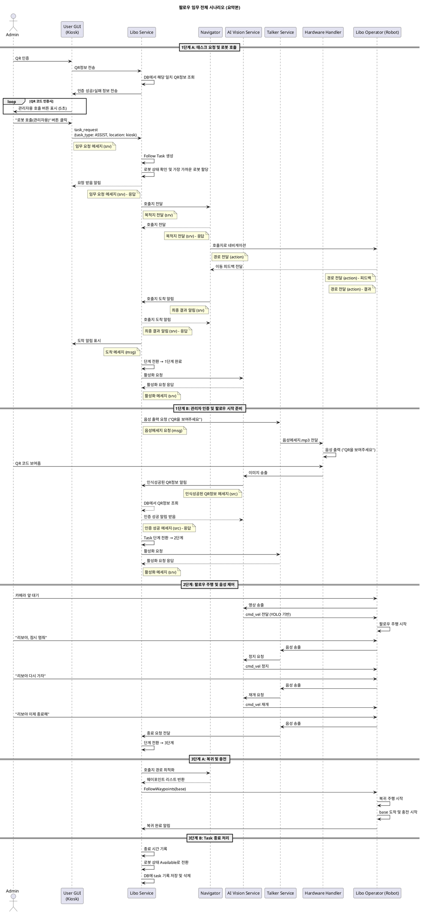
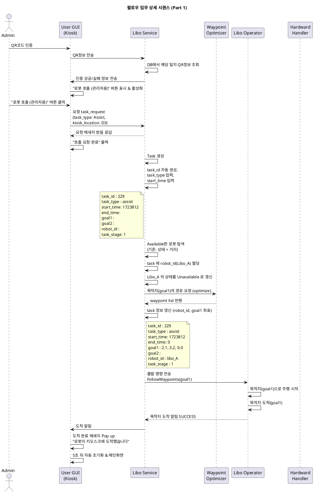
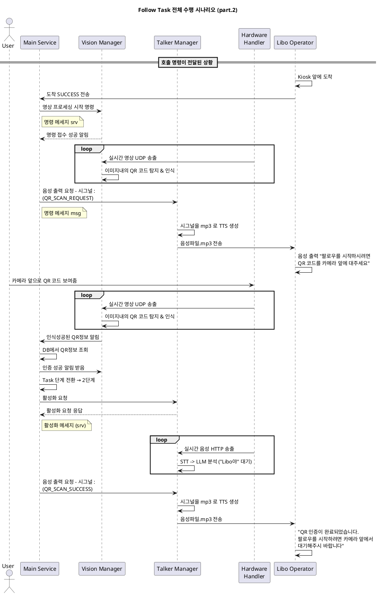
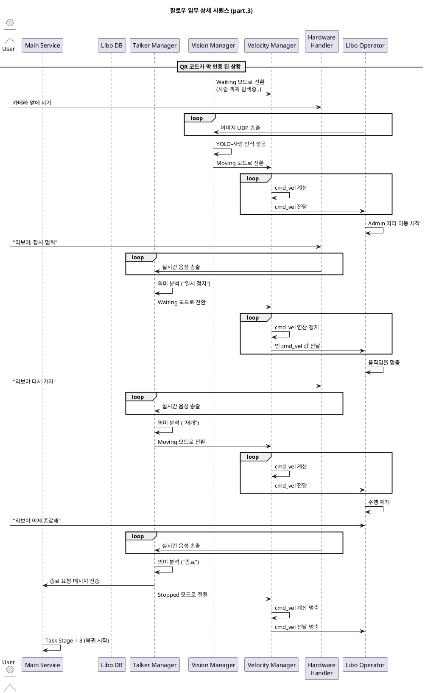
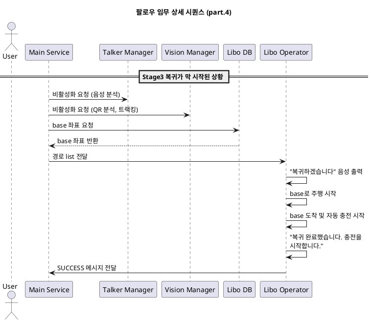

## 1. 팔로우 임무 전체 시나리오 (요약본)

```plantuml
@startuml

title 팔로우 임무 전체 시나리오 (요약본)

  

actor Admin

participant "User GUI\n(Kiosk)" as Kiosk

participant "Libo Service" as Main

participant "Navigator" as Nav

  

participant "AI Vision Service" as Vision

participant "Talker Service" as Talker

  

participant "Hardware Handler" as Handler

participant "Libo Operator (Robot)" as Robot

  

== 1단계 A: 태스크 요청 및 로봇 호출 ==

  

Admin -> Kiosk : QR 인증

Kiosk -> Main : QR정보 전송

Main -> Main : DB에서 해당 일치 QR정보 조회

Main -> Kiosk : 인증 성공/실패 정보 전송

loop QR 코드 인증시

Kiosk -> Admin : 관리자용 호출 버튼 표시 (5초)

end

Admin -> Kiosk : "로봇 호출(관리자용)" 버튼 클릭

Kiosk -> Main : task_request\n(task_type: ASSIST, location: kiosk)

note right of Kiosk : 임무 요청 메세지 (srv)

  

Main -> Main : Follow Task 생성

Main -> Main : 로봇 상태 확인 및 가장 가까운 로봇 할당

  

Main --> Kiosk : 요청 받음 알림

note left of Main : 임무 요청 메세지 (srv) - 응답

  

Main -> Nav: 호출지 전달

note right of Main : 목적지 전달 (srv)

Nav --> Main: 호출지 전달

note Left of Nav : 목적지 전달 (srv) - 응답

  

Nav -> Robot: 호출지로 네비게이션

note right of Nav : 경로 전달 (action)

Robot --> Nav: 이동 피드백 전달

note left of Robot : 경로 전달 (action) - 피드백

note left of Robot : 경로 전달 (action) - 결과

  

' Robot -> Robot : 호출지로 이동

Nav -> Main : 호출지 도착 알림

note left of Nav : 최종 결과 알림 (srv)

Main --> Nav : 호출지 도착 알림

note right of Main : 최종 결과 알림 (srv) - 응답

  
  

Main -> Kiosk : 도착 알림 표시

note left of Main : 도착 메세지 (msg)

Main -> Main : 단계 전환 → 1단계 완료

Main -> Vision : 활성화 요청

Vision --> Main : 활성화 요청 응답

note right of Main : 활성화 메세지 (srv)

  
  
  
  

== 1단계 B: 관리자 인증 및 팔로우 시작 준비 ==

  

Main -> Talker : 음성 출력 요청 ("QR을 보여주세요")

note right of Main : 음성메세지 요청 (msg)

Talker -> Handler : 음성메세지.mp3 전달

Handler -> Handler : 음성 출력 ("QR을 보여주세요")

Admin -> Handler : QR 코드 보여줌

Handler -> Vision : 이미지 송출

Vision -> Main : 인식성공된 QR정보 알림

note left of Vision : 인식성공된 QR정보 메세지 (src)

Main --> Main : DB에서 QR정보 조회

Main --> Vision : 인증 성공 알림 받음

note right of Main : 인증 성공 메세지 (src) - 응답

  

Main -> Main : Task 단계 전환 → 2단계

Main -> Talker : 활성화 요청

Talker --> Main : 활성화 요청 응답

note right of Main : 활성화 메세지 (srv)

  
  
  
  
  
  

== 2단계: 팔로우 주행 및 음성 제어 ==

  

Admin -> Robot : 카메라 앞 대기

Robot -> Vision : 영상 송출

Vision -> Robot : cmd_vel 전달 (YOLO 기반)

Robot -> Robot : 팔로우 주행 시작

  

Admin -> Robot : "리보야, 잠시 멈춰"

Robot -> Talker : 음성 송출

Talker -> Vision : 정지 요청

Vision -> Robot : cmd_vel 정지

  

Admin -> Robot : "리보야 다시 가자"

Robot -> Talker : 음성 송출

Talker -> Vision : 재개 요청

Vision -> Robot : cmd_vel 재개

  

Admin -> Robot : "리보야 이제 종료해"

Robot -> Talker : 음성 송출

Talker -> Main : 종료 요청 전달

Main -> Main : 단계 전환 → 3단계

  

== 3단계 A: 복귀 및 충전 ==

  

Main -> Nav : 호출지 경로 최적화

Nav --> Main : 웨이포인트 리스트 반환

Main -> Robot : FollowWaypoints(base)

Robot -> Robot : 복귀 주행 시작

Robot -> Robot : base 도착 및 충전 시작

Robot -> Main : 복귀 완료 알림

  

== 3단계 B: Task 종료 처리 ==

  

Main -> Main : 종료 시간 기록

Main -> Main : 로봇 상태 Available로 전환

Main -> Main : DB에 task 기록 저장 및 삭제

  

@enduml
```

## 팔로우 임무 상세 시퀀스 Part 1

```plantuml
@startuml

title 팔로우 임무 상세 시퀀스 (Part 1)

  

actor Admin as User

participant "User GUI\n(Kiosk)" as Kiosk

participant "Libo Service" as Main

participant "Waypoint\nOptimizer" as Runner

participant "Libo Operator" as Robot

participant "Hardward\nHandler" as Handler

  

User -> Kiosk : QR코드 인증

Kiosk -> Main : QR정보 전송

Main -> Main : DB에서 해당 일치 QR정보 조회

Main -> Kiosk : 인증 성공/실패 정보 전송

Kiosk -> Kiosk : "로봇 호출 (관리자용)" 버튼 표시 & 활성화

  

User -> Kiosk : "로봇 호출 (관리자용)" 버튼 클릭

Kiosk -> Main : 요청 task_request\n(task_type: Assist,\nkiosk_location: D3)

Main --> Kiosk : 요청 메세지 받음 응답

Kiosk -> Kiosk : "호출 요청 완료" 출력

  

Main -> Main : Task 생성

Main -> Main : task_id 자동 생성, \ntask_type 입력, \nstart_time 입력

note left of Main : task_id : 229\ntask_type : assist\nstart_time: 1723812\nend_time: \ngoal1 : \ngoal2 : \nrobot_id : \ntask_stage: 1

  

Main -> Main : Available한 로봇 탐색\n(기준: 상태 + 거리)

Main -> Main : task 에 robot_id(Libo_A) 할당

Main -> Main : Libo_A 의 상태를 Unavailable 로 갱신

Main -> Runner : 목적지(goal1)의 경로 요청 (optimize)

Runner --> Main : waypoint list 반환

Main -> Main : task 정보 갱신 (robot_id, goal1 좌표)

  

note right of Main : task_id : 229\ntask_type : assist\nstart_time: 1723812\nend_time: 0\ngoal1 : 2.1, 3.2, 0.0\ngoal2 :\nrobot_id : libo_A\ntask_stage : 1

  

Main -> Robot : 출발 명령 전송\nFollowWaypoints(goal1)

Robot -> Robot : 목적지(goal1)으로 주행 시작

Robot -> Robot : 목적지 도착(goal1)

Robot --> Main : 목적지 도착 알림 SUCCESS

Main -> Kiosk : 도착 알림

Kiosk -> Kiosk : 도착 완료 메세지 Pop up\n"로봇이 키오스크에 도착했습니다"

Kiosk -> Kiosk : 5초 뒤 자동 초기화 & 메인화면

  

@enduml
```

## 팔로우 임무 상세 시퀀스 Part 2

```plantuml
@startuml

skinparam maxMessageSize 200

  

title Follow Task 전체 수행 시나리오 (part.2)

  

actor User as Admin

participant "Main Service" as Main

participant "Vision Manager" as Vision

participant "Talker Manager" as Talker

  

participant "Hardware\nHandler" as Handler

participant "Libo Operator" as Robot

  

== 호출 명령이 전달된 상황 ==

Robot -> Robot : Kiosk 앞에 도착

Robot -> Main : 도착 SUCCESS 전송

Main -> Vision : 영상 프로세싱 시작 명령

note right of Main : 명령 메세지 srv

Vision --> Main : 명령 접수 성공 알림

loop

Handler -> Vision : 실시간 영상 UDP 송출

Vision -> Vision : 이미지내의 QR 코드 탐지 & 인식

end

Main -> Talker : 음성 출력 요청 - 시그널 : (QR_SCAN_REQUEST)

note right of Main : 명령 메세지 msg

Talker -> Talker : 시그널을 mp3 로 TTS 생성

Talker -> Robot : 음성파일.mp3 전송

  

Robot -> Robot : 음성 출력 "팔로우를 시작하시려면 QR 코드를 카메라 앞에 대주세요"

Admin -> Handler : 카메라 앞으로 QR 코드 보여줌

loop

Handler -> Vision : 실시간 영상 UDP 송출

Vision -> Vision : 이미지내의 QR 코드 탐지 & 인식

end

  

Vision -> Main : 인식성공된 QR정보 알림

Main -> Main : DB에서 QR정보 조회

Main -> Vision : 인증 성공 알림 받음

  

Main -> Main : Task 단계 전환 → 2단계

Main -> Talker : 활성화 요청

Talker --> Main : 활성화 요청 응답

note right of Main : 활성화 메세지 (srv)

loop

Handler -> Talker : 실시간 음성 HTTP 송출

Talker -> Talker : STT -> LLM 분석 ("Libo야" 대기)

end

  

Main -> Talker : 음성 출력 요청 - 시그널 : (QR_SCAN_SUCCESS)

Talker -> Talker : 시그널을 mp3 로 TTS 생성

Talker -> Robot : 음성파일.mp3 전송

Robot -> Robot : "QR 인증이 완료되었습니다. 팔로우를 시작하려면 카메라 앞에서 대기해주시 바랍니다"

  
  

@enduml
```

## 팔로우 임무 상세 시퀀스 Part 3

```plantuml
@startuml

skinparam maxMessageSize 200

  

title 팔로우 임무 상세 시퀀스 (part.3)

  

actor User as Admin

participant "Main Service" as Main

participant "Libo DB" as DB

participant "Talker Manager" as Talker

participant "Vision Manager" as Vision

participant "Velocity Manager" as Velocity

  

participant "Hardware\nHandler" as Handler

participant "Libo Operator" as Robot

  

== QR 코드가 막 인증 된 상황 ==

  

Vision -> Velocity : Waiting 모드로 전환\n(사람 객체 탐색중..)

  

Admin -> Handler : 카메라 앞에 서기

loop

Robot -> Vision : 이미지 UDP 송출

end

Vision -> Vision : YOLO-사람 인식 성공

Vision -> Velocity : Moving 모드로 전환

  

loop

Velocity -> Velocity : cmd_vel 계산

Velocity -> Robot : cmd_vel 전달

end

  

Robot -> Robot : Admin 따라 이동 시작

  
  
  

Admin -> Handler : "리보야, 잠시 멈춰"

loop

Handler -> Talker : 실시간 음성 송출

end

Talker -> Talker : 의미 분석 ("일시 정지")

Talker -> Velocity : Waiting 모드로 전환

loop

Velocity -> Velocity : cmd_vel 연산 정지

Velocity -> Robot : 빈 cmd_vel 값 전달

end

Robot -> Robot : 움직임을 멈춤

  
  
  

Admin -> Handler : "리보야 다시 가자"

loop

Handler -> Talker : 실시간 음성 송출

end

  

Talker -> Talker : 의미 분석 ("재개")

Talker -> Velocity : Moving 모드로 전환

loop

Velocity -> Velocity : cmd_vel 계산

Velocity -> Robot : cmd_vel 전달

end

Robot -> Robot : 주행 재개

  
  
  
  

Admin -> Robot : "리보야 이제 종료해"

loop

Handler -> Talker : 실시간 음성 송출

end

Talker -> Talker : 의미 분석 ("종료")

Talker -> Main : 종료 요청 메시지 전송

  

Talker -> Velocity : Stopped 모드로 전환

Velocity -> Velocity : cmd_vel 계산 멈춤

Velocity -> Robot : cmd_vel 전달 멈춤

  
  

Main -> Main : Task Stage = 3 (복귀 시작)

  

@enduml
```

## 팔로우 임무 시퀀스 Part 4

```plantuml
  

@startuml

skinparam maxMessageSize 200

  

title 팔로우 임무 상세 시퀀스 (part.4)

  

actor User as Admin

participant "Main Service" as Main

participant "Talker Manager" as Talker

participant "Vision Manager" as Vision

participant "Libo DB" as DB

participant "Libo Operator" as Robot

  

== Stage3 복귀가 막 시작된 상황 ==

Main -> Talker : 비활성화 요청 (음성 분석)

Main -> Vision : 비활성화 요청 (QR 분석, 트랙킹)

Main -> DB : base 좌표 요청

DB --> Main : base 좌표 반환

Main -> Robot : 경로 list 전달

Robot -> Robot : "복귀하겠습니다" 음성 출력

Robot -> Robot : base로 주행 시작

Robot -> Robot : base 도착 및 자동 충전 시작

Robot -> Robot : "복귀 완료했습니다. 충전을 시작합니다."

Robot -> Main : SUCCESS 메시지 전달

  

' == Task 정리 및 저장 ==

  

' Main -> Main : task 종료 시간 기록

' Main -> Main : robot 상태를 Available로 전환

' Main -> DB : task 기록 저장 및 메모리 상 task 삭제

  

@enduml
```
