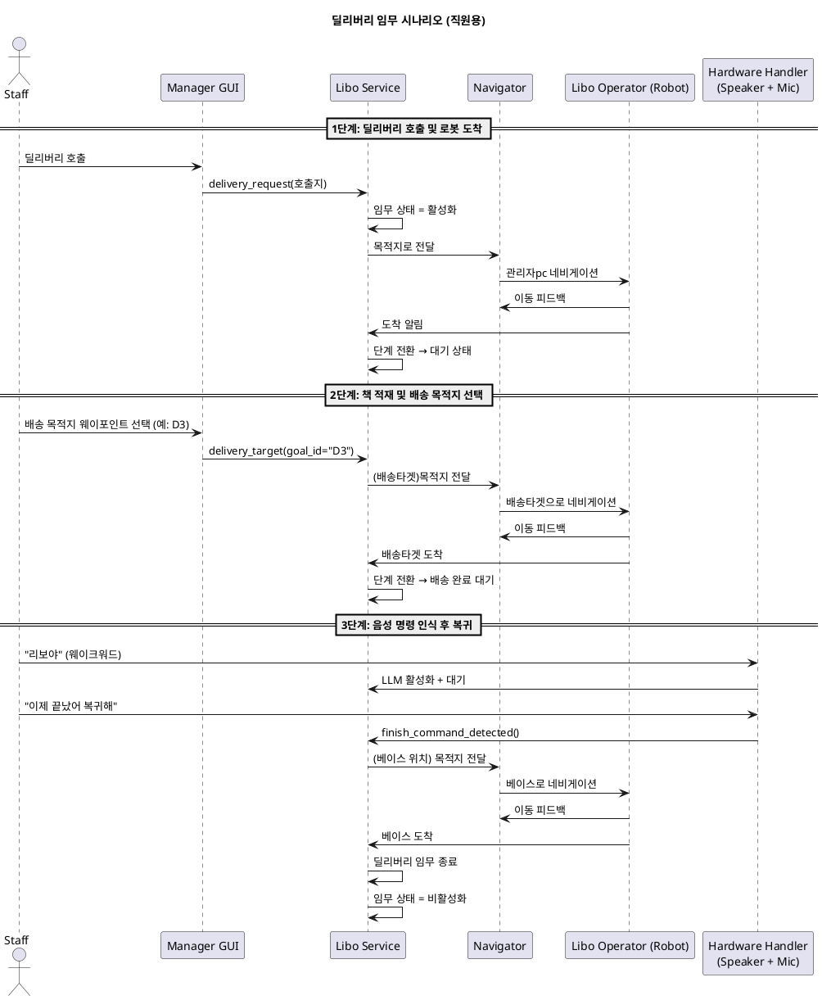

## 딜리버리 임무 시나리오(직원용)

```plantuml
@startuml

title 딜리버리 임무 시나리오 (직원용)

  

actor Staff

participant "Manager GUI" as GUI

participant "Libo Service" as LiboSvc

participant "Navigator" as WPOpt

participant "Libo Operator (Robot)" as Libo

participant "Hardware Handler\n(Speaker + Mic)" as HW

  

== 1단계: 딜리버리 호출 및 로봇 도착 ==

  

Staff -> GUI: 딜리버리 호출

GUI -> LiboSvc: delivery_request(호출지)

  

LiboSvc -> LiboSvc: 임무 상태 = 활성화

  

LiboSvc -> WPOpt: 목적지로 전달

WPOpt -> Libo: 관리자pc 네비게이션

Libo -> WPOpt: 이동 피드백

Libo -> LiboSvc: 도착 알림

  
  

LiboSvc -> LiboSvc: 단계 전환 → 대기 상태

  

== 2단계: 책 적재 및 배송 목적지 선택 ==

  

Staff -> GUI: 배송 목적지 웨이포인트 선택 (예: D3)

GUI -> LiboSvc: delivery_target(goal_id="D3")

  

LiboSvc -> WPOpt: (배송타겟)목적지 전달

WPOpt -> Libo: 배송타겟으로 네비게이션

Libo -> WPOpt: 이동 피드백

Libo -> LiboSvc: 배송타겟 도착

  

LiboSvc -> LiboSvc: 단계 전환 → 배송 완료 대기

  

== 3단계: 음성 명령 인식 후 복귀 ==

  

Staff -> HW: "리보야" (웨이크워드)

HW -> LiboSvc: LLM 활성화 + 대기

  

Staff -> HW: "이제 끝났어 복귀해"

HW -> LiboSvc: finish_command_detected()

  

LiboSvc -> WPOpt: (베이스 위치) 목적지 전달

WPOpt -> Libo: 베이스로 네비게이션

Libo -> WPOpt: 이동 피드백

Libo -> LiboSvc: 베이스 도착

  

LiboSvc -> LiboSvc: 딜리버리 임무 종료

LiboSvc -> LiboSvc: 임무 상태 = 비활성화

  
  

@enduml
```
