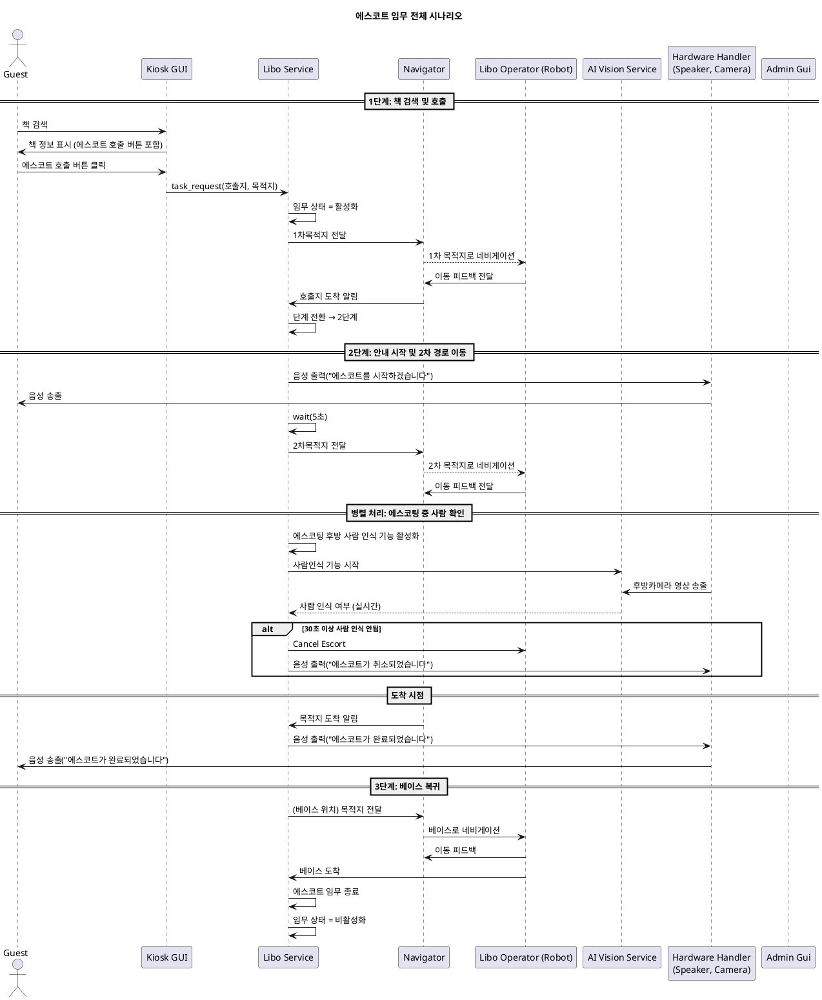
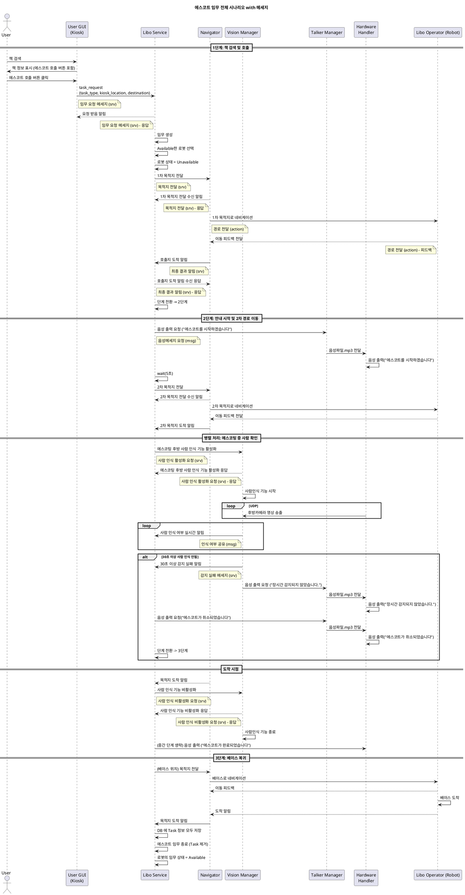

## 1. 에스코트 임무 전체 시나리오

```plantuml
@startuml

title 에스코트 임무 전체 시나리오

  

actor Guest

participant "Kiosk GUI" as Kiosk

participant "Libo Service" as LiboSvc

participant "Navigator" as WPOpt

participant "Libo Operator (Robot)" as Libo

participant "AI Vision Service" as Vision

participant "Hardware Handler\n(Speaker, Camera)" as HW

participant "Admin Gui"

  

== 1단계: 책 검색 및 호출 ==

  

Guest -> Kiosk: 책 검색

Kiosk -> Guest: 책 정보 표시 (에스코트 호출 버튼 포함)

  

Guest -> Kiosk: 에스코트 호출 버튼 클릭

Kiosk -> LiboSvc: task_request(호출지, 목적지)

  

LiboSvc -> LiboSvc: 임무 상태 = 활성화

  

LiboSvc -> WPOpt: 1차목적지 전달

WPOpt --> Libo: 1차 목적지로 네비게이션

Libo -> WPOpt: 이동 피드백 전달

  

WPOpt -> LiboSvc: 호출지 도착 알림

LiboSvc -> LiboSvc: 단계 전환 → 2단계

  

== 2단계: 안내 시작 및 2차 경로 이동 ==

  

LiboSvc -> HW: 음성 출력("에스코트를 시작하겠습니다")

HW -> Guest: 음성 송출

  

LiboSvc -> LiboSvc: wait(5초)

  

LiboSvc -> WPOpt: 2차목적지 전달

WPOpt --> Libo: 2차 목적지로 네비게이션

Libo -> WPOpt: 이동 피드백 전달

  

== 병렬 처리: 에스코팅 중 사람 확인 ==

LiboSvc -> LiboSvc: 에스코팅 후방 사람 인식 기능 활성화

LiboSvc -> Vision: 사람인식 기능 시작

HW -> Vision: 후방카메라 영상 송출

Vision --> LiboSvc: 사람 인식 여부 (실시간)

  

alt 30초 이상 사람 인식 안됨

LiboSvc -> Libo: Cancel Escort

LiboSvc -> HW: 음성 출력("에스코트가 취소되었습니다")

end

  

== 도착 시점 ==

  

WPOpt -> LiboSvc: 목적지 도착 알림

LiboSvc -> HW: 음성 출력("에스코트가 완료되었습니다")

HW -> Guest: 음성 송출("에스코트가 완료되었습니다")

  

== 3단계: 베이스 복귀 ==

  

LiboSvc -> WPOpt: (베이스 위치) 목적지 전달

  

WPOpt -> Libo: 베이스로 네비게이션

Libo -> WPOpt: 이동 피드백

Libo -> LiboSvc: 베이스 도착

  

LiboSvc -> LiboSvc: 에스코트 임무 종료

LiboSvc -> LiboSvc: 임무 상태 = 비활성화

  

@enduml
```

## 2. 에스코트 임무 전체 시나리오 with 메세지 종류

```plantuml
  

@startuml

title 에스코트 임무 전체 시나리오 with 메세지

  

actor User

participant "User GUI\n(Kiosk)" as Kiosk

participant "Libo Service" as Main

participant "Navigator" as Nav

participant "Vision Manager" as Vision

participant "Talker Manager" as Talker

participant "Hardware\nHandler" as Handler

participant "Libo Operator (Robot)" as Robot

  

== 1단계: 책 검색 및 호출 ==

  

User -> Kiosk: 책 검색

Kiosk -> User: 책 정보 표시 (에스코트 호출 버튼 포함)

  

User -> Kiosk: 에스코트 호출 버튼 클릭

Kiosk -> Main: task_request\n(task_type, kiosk_location, destination)

note right of Kiosk: 임무 요청 메세지 (srv)

  

Main --> Kiosk: 요청 받음 알림

note left of Main: 임무 요청 메세지 (srv) - 응답

  

Main -> Main: 임무 생성

Main -> Main: Available한 로봇 선택

Main -> Main: 로봇 상태 = Unavailable

  

Main -> Nav: 1차 목적지 전달

note right of Main: 목적지 전달 (srv)

Nav --> Main: 1차 목적지 전달 수신 알림

note left of Nav: 목적지 전달 (srv) - 응답

  
  

Nav -> Robot: 1차 목적지로 네비게이션

note right of Nav: 경로 전달 (action)

Robot --> Nav: 이동 피드백 전달

note left of Robot: 경로 전달 (action) - 피드백

  

Nav -> Main: 호출지 도착 알림

note left of Nav: 최종 결과 알림 (srv)

Main --> Nav: 호출지 도착 알림 수신 응답

note right of Main : 최종 결과 알림 (srv) - 응답

Main -> Main: 단계 전환 → 2단계

  
  
  
  
  

== 2단계: 안내 시작 및 2차 경로 이동 ==

Main -> Talker : 음성 출력 요청 ("에스코트를 시작하겠습니다")

note right of Main : 음성메세지 요청 (msg)

Talker -> Handler : 음성파일.mp3 전달

Handler -> Handler: 음성 출력("에스코트를 시작하겠습니다")

  

Main -> Main: wait(5초)

  

Main -> Nav: 2차 목적지 전달

Nav --> Main: 2차 목적지 전달 수신 알림

  

Nav -> Robot: 2차 목적지로 네비게이션

Robot --> Nav: 이동 피드백 전달

Nav -> Main: 2차 목적지 도착 알림

  
  
  
  
  

== 병렬 처리: 에스코팅 중 사람 확인 ==

  

Main -> Vision: 에스코팅 후방 사람 인식 기능 활성화

note right of Main : 사람 인식 활성화 요청 (srv)

Vision --> Main: 에스코팅 후방 사람 인식 기능 활성화 응답

note left of Vision : 사람 인식 활성화 요청 (srv) - 응답

Vision -> Vision: 사람인식 기능 시작

  

loop UDP

Handler -> Vision: 후방카메라 영상 송출

end

  

loop

Vision -> Main: 사람 인식 여부 실시간 알림

note left of Vision: 인식 여부 공유 (msg)

end

  
  

alt 30초 이상 사람 인식 안됨

Vision -> Main: 30초 이상 감지 실패 알림

note left of Vision: 감지 실패 메세지 (srv)

Vision -> Talker: 음성 출력 요청 ("장시간 감지되지 않았습니다.")

Talker -> Handler: 음성파일.mp3 전달

Handler -> Handler: 음성 출력("장시간 감지되지 않았습니다.")

Main -> Talker: 음성 출력 요청("에스코트가 취소되었습니다")

Talker -> Handler: 음성파일.mp3 전달

Handler -> Handler: 음성 출력("에스코트가 취소되었습니다")

Main -> Main : 단계 전환 -> 3단계

end

  
  
  
  
  
  

== 도착 시점 ==

  

Nav --> Main: 목적지 도착 알림

Main -> Vision: 사람 인식 기능 비활성화

note right of Main : 사람 인식 비활성화 요청 (srv)

Vision --> Main: 사람 인식 기능 비활성화 응답

note left of Vision : 사람 인식 비활성화 요청 (srv) - 응답

Vision -> Vision: 사람인식 기능 종료

  

Main -> Handler: (중간 단계 생략) 음성 출력 ("에스코트가 완료되었습니다")

  

== 3단계: 베이스 복귀 ==

  

Main -> Nav: (베이스 위치) 목적지 전달

  

Nav -> Robot: 베이스로 네비게이션

Robot --> Nav: 이동 피드백

  

Robot -> Robot: 베이스 도착

Robot --> Nav: 도착 알림

Nav -> Main : 목적지 도착 알림

  

Main -> Main: DB 에 Task 정보 모두 저장

Main -> Main: 에스코트 임무 종료 (Task 제거)

Main -> Main: 로봇의 임무 상태 = Available

  

@enduml

  
  

' @startuml

' title 에스코트 임무 전체 시나리오 with 메세지

  

' actor User

' participant "User GUI\n(Kiosk)" as Kiosk

' participant "Libo Service" as Main

' participant "Navigator" as Nav

' participant "Vision Manager" as Vision

' participant "Hardware Handler\n(Speaker, Camera)" as Handler

' participant "Libo Operator (Robot)" as Robot

  

' == 1단계: 책 검색 및 호출 ==

  

' User -> Kiosk: 책 검색

' Kiosk -> User: 책 정보 표시 (에스코트 호출 버튼 포함)

  

' User -> Kiosk: 에스코트 호출 버튼 클릭

' Kiosk -> Main: task_request\n(task_type, kiosk_location, destination)

' Main --> Kiosk: 요청 받음 알림

  

' Main -> Main: 임무 생성

' Main -> Main : Available한 로봇 선택

' Main -> Main : 로봇 상태 = Unavailable

  

' Main -> Nav: 1차목적지 전달

' Nav -> Robot: 1차 목적지로 네비게이션

' Robot --> Nav: 이동 피드백 전달

  

' Nav -> Main: 호출지 도착 알림

' Main -> Main: 단계 전환 → 2단계

  

' == 2단계: 안내 시작 및 2차 경로 이동 ==

  

' Main -> Handler: 음성 출력("에스코트를 시작하겠습니다")

' Handler -> User: 음성 송출

  

' Main -> Main: wait(5초)

  

' Main -> Nav: 2차목적지 전달

' Nav --> Robot: 2차 목적지로 네비게이션

' Robot -> Nav: 이동 피드백 전달

  

' == 병렬 처리: 에스코팅 중 사람 확인 ==

' Main -> Main: 에스코팅 후방 사람 인식 기능 활성화

' Main -> Vision: 사람인식 기능 시작

' Handler -> Vision: 후방카메라 영상 송출

' Vision --> Main: 사람 인식 여부 (실시간)

  

' alt 30초 이상 사람 인식 안됨

' Main -> Robot: Cancel Escort

' Main -> Handler: 음성 출력("에스코트가 취소되었습니다")

' end

  

' == 도착 시점 ==

  

' Nav -> Main: 목적지 도착 알림

' Main -> Handler: 음성 출력("에스코트가 완료되었습니다")

' Handler -> User: 음성 송출("에스코트가 완료되었습니다")

  

' == 3단계: 베이스 복귀 ==

  

' Main -> Nav: (베이스 위치) 목적지 전달

  

' Nav -> Robot: 베이스로 네비게이션

' Robot -> Nav: 이동 피드백

' Robot -> Main: 베이스 도착

  

' Main -> Main: 에스코트 임무 종료

' Main -> Main: 임무 상태 = 비활성화

  

' @enduml
```
